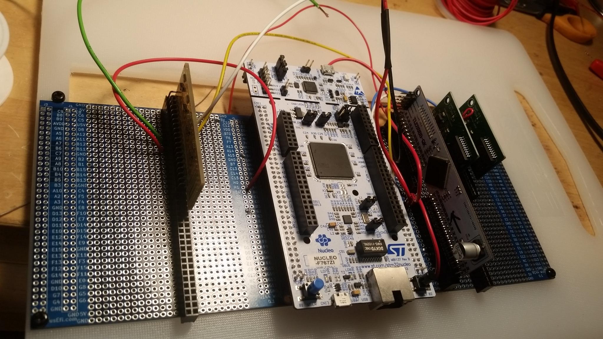

Home of rusEfi modular prototyping hardware

https://github.com/rusefi/rusefi

Depends on libraries from https://github.com/rusefi/kicad-libraries

If you download complete repo do not forget to download libraries. If you git clone be sure to also

`git submodule update --init`

# Modules

[Nucleo 144 base board](NUCLEO144_wing)

[6 channel hi-side driver](highside_module)

[Protected Analog Inputs Module](Analog_Input_Module)

[TLE7209 or MC33186 H-Bridge](TLE7209_or_MC33186_H-Bridge_Breakout)

[TLE8888 base chip](TLE8888_Module)

# See also

[Forum thread](https://rusefi.com/forum/viewtopic.php?f=4&t=1459)

If you download complete repo do not forget to download libraries. If you git clone be sure to also

`git submodule update --init`

See [Manhattan Standard](Manhattan_standard.md)