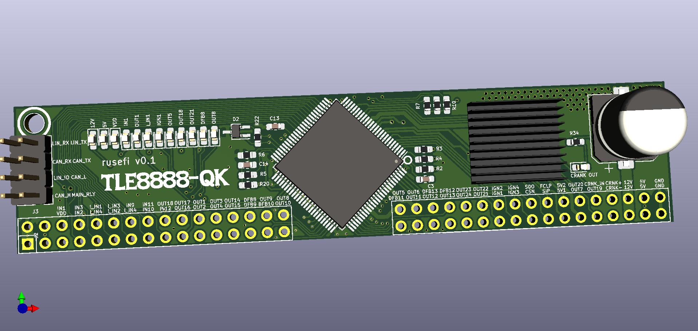

iBom https://rusefi.com/docs/ibom/TLE8888_Module_latest.html

[Forum thread](https://rusefi.com/forum/viewtopic.php?f=4&t=1496)

Brief overview of functionality

12v input: single input

5v output: build-in linear regulator

vdd input: logic level voltage from MCU used as reference to SPI etc communication


Open collector hall configurations:
DNP=R9=R15=R16=C12=C15. R17=2.7K R12=10K 
R13=0R R18=2.7K R19=2.7K


Validation: R(VR_IN_2, GND


```
Known issues:
  1)    fixed in 0.2      R25, R28, R14, R34 pull up LEDs up on TTL signals
```