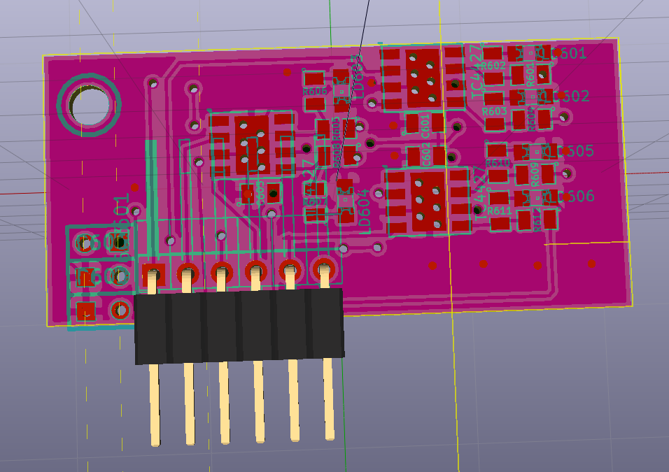

Based on https://github.com/rusefi/rusefi/tree/master/hardware/hi-lo_driver

```
 1) ???? the part number is for SOIC package but the board has MSOP package. Part number should be TC4427AEUA
v 0.3 ordered on 03/12/2019
 2)                  fix 3D
```


